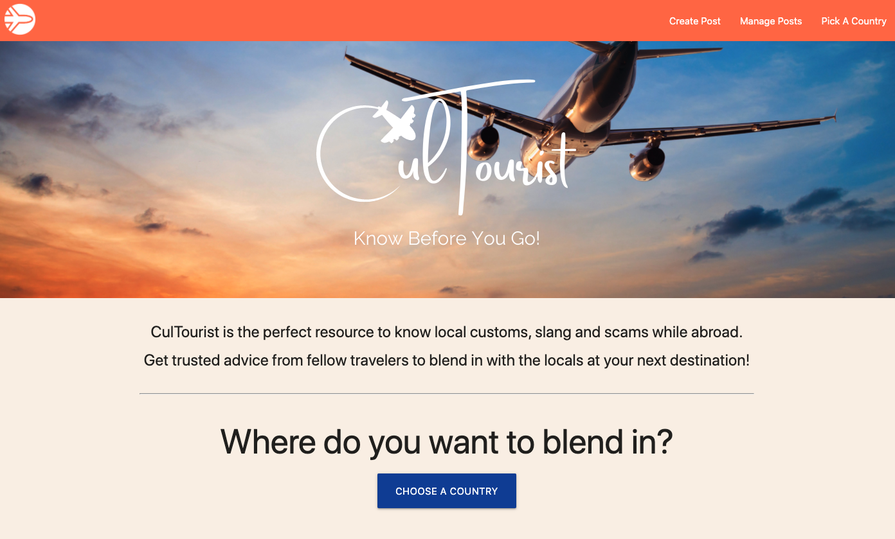
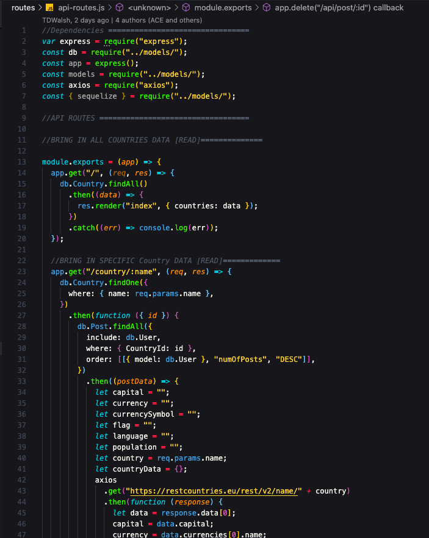
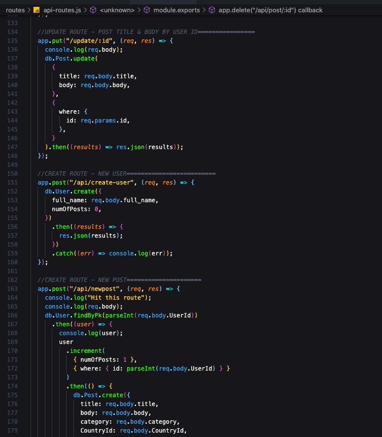
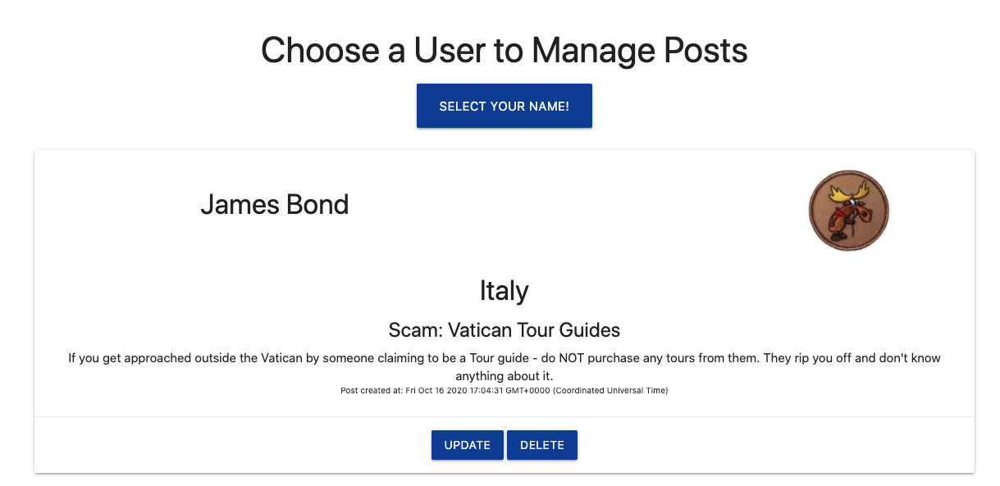
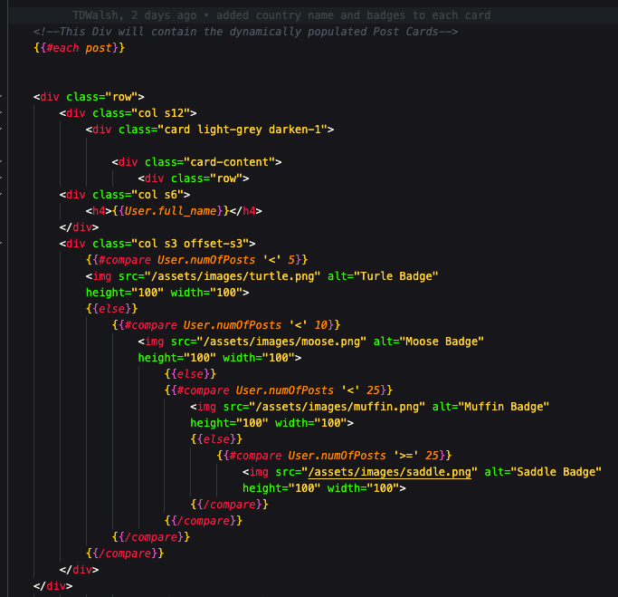
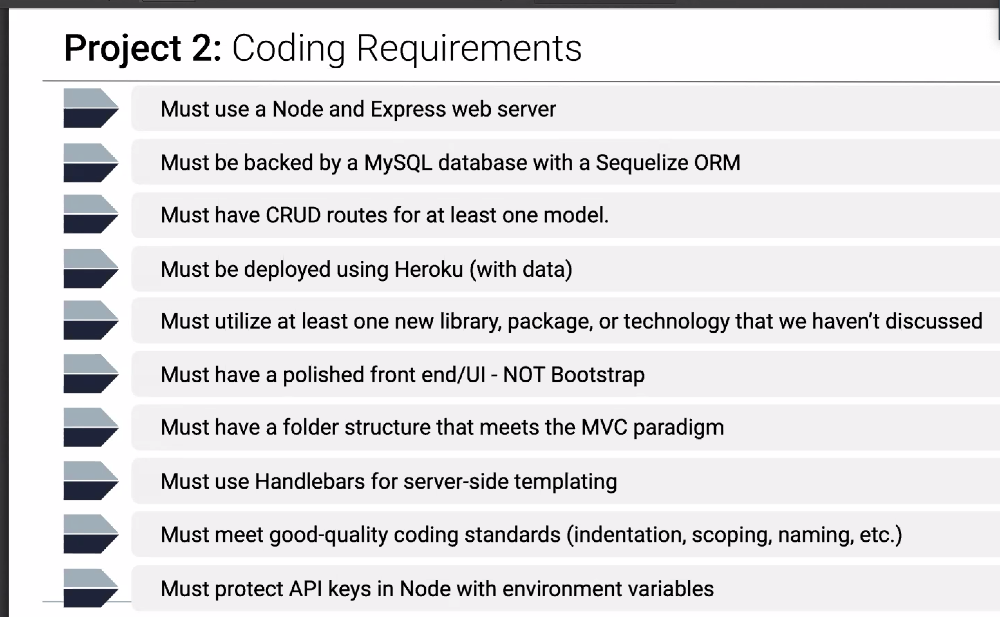

# cultourist_app

## Description
This application helps inform travellers about the culture, scams, slang, and nuances of a particular country through the sharing of experiences by prior visitors of those countries.

## Deployed Application Link
This application is deployed on Heroku.

[Know before you go by visiting here...](https://cultourist.herokuapp.com/)

## Contents

This application adheres to MVC file structure requirements.

It includes full CRUD methods, as it provides the ability to create, read, update, and delete user posts regarding countries that users have visited. 

Here are a few screengrabs...

To add additional functionality to the application we included user post level badges to incorporate an element of gamification as shown here...

## Resources

* [Handlebars Partials](https://handlebarsjs.com/guide/#partials)

## Technologies

Front End -

* HTML5 
* Materialize CSS
* JavaScript 
* jQuery 
* AJAX
* JSON
* Handlebars
* Express-Handlebars

Back End -

* MySQL
* Sequelize 
* Node.js 
* Express.js 
* RestCountriesEU. API 
* Heroku
* JAWSDB

## Credits & Contributions

We collectively want to say thank you to our TA Staff: Peter Colella, Christina Starr, Leif Hetland, JD Tadlock and Phil Simmons, for their time and expertise throughout the duration of this project. 

We also want to thank our tutors who shared a few additional insights as well.

We experienced a few challenges along the way and they were instrumental in helping us troubleshoot to make our project a success.

## Application Requirements

## Badges

## Contact

* Ryan Flanagan - 
* Aimee Esler - 
* Aubrey Polk - 
* Dane Walsh - 

## License

Copyright 2020 - 
Ryan Flanagan / Aubrey Polk / Dane Walsh / Aimee Esler

Permission is hereby granted, free of charge, to any person obtaining a copy of this software and associated documentation files (the "Software"), to deal in the Software without restriction, including without limitation the rights to use, copy, modify, merge, publish, distribute, sublicense, and/or sell copies of the Software, and to permit persons to whom the Software is furnished to do so, subject to the following conditions:

The above copyright notice and this permission notice shall be included in all copies or substantial portions of the Software.

THE SOFTWARE IS PROVIDED "AS IS", WITHOUT WARRANTY OF ANY KIND, EXPRESS OR IMPLIED, INCLUDING BUT NOT LIMITED TO THE WARRANTIES OF MERCHANTABILITY, FITNESS FOR A PARTICULAR PURPOSE AND NONINFRINGEMENT. IN NO EVENT SHALL THE AUTHORS OR COPYRIGHT HOLDERS BE LIABLE FOR ANY CLAIM, DAMAGES OR OTHER LIABILITY, WHETHER IN AN ACTION OF CONTRACT, TORT OR OTHERWISE, ARISING FROM, OUT OF OR IN CONNECTION WITH THE SOFTWARE OR THE USE OR OTHER DEALINGS IN THE SOFTWARE.
